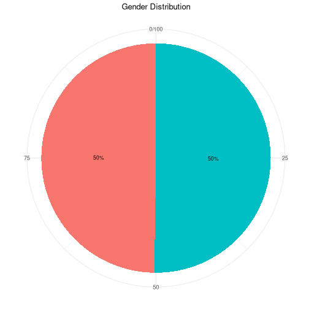
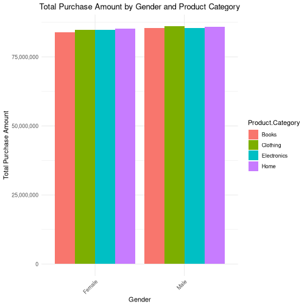
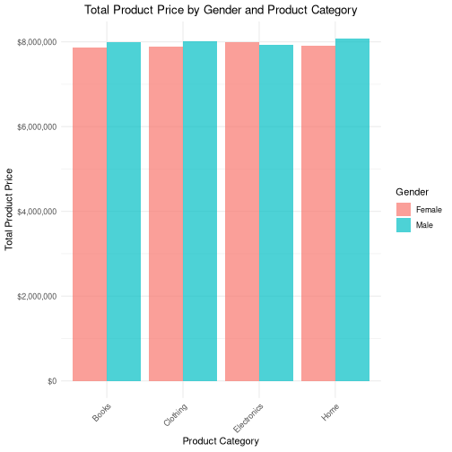
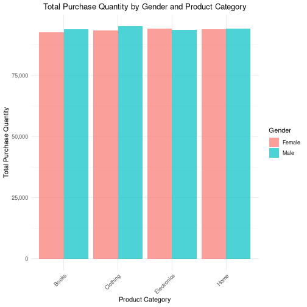
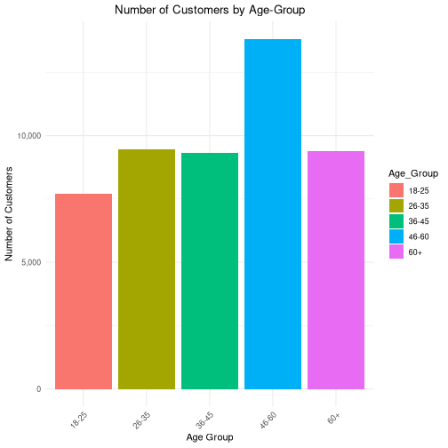
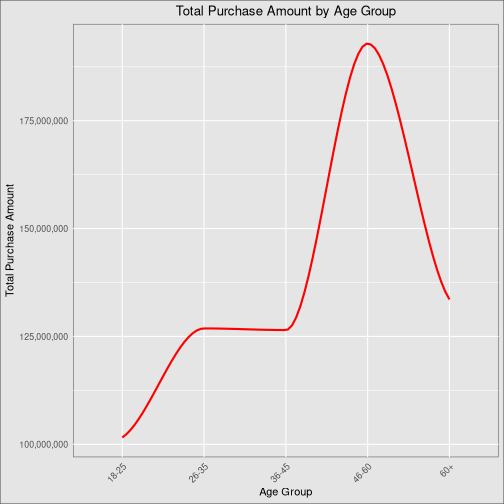
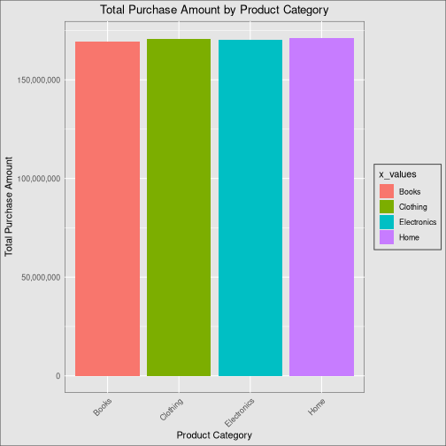
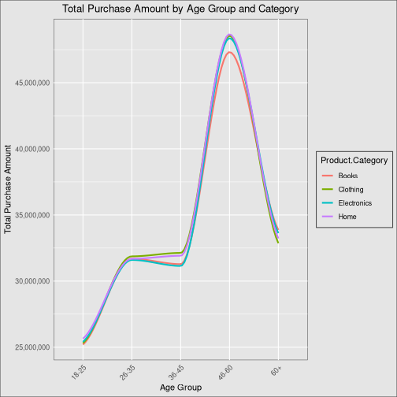
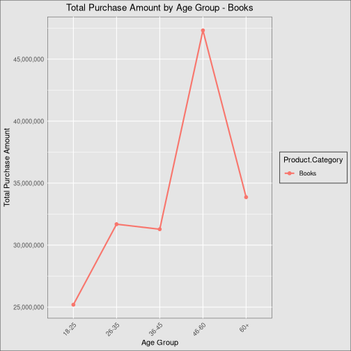
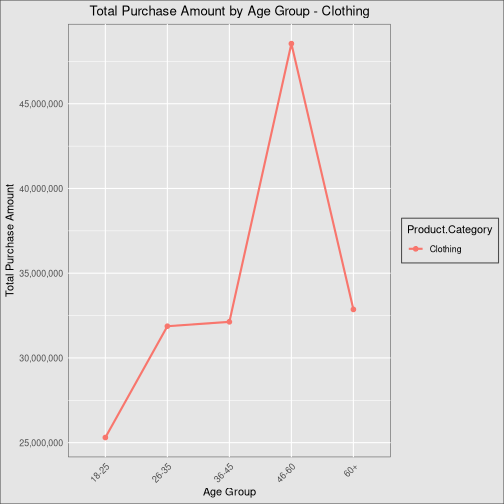

# Customer Purchasing Behavior based on gender and age in relation to product categories (Electronics, Books, Home, Clothing).

Date: 2024-02-05


```r
# Read CSV file into a data frame
csv_path <- "dataset_for_project.csv"
customer_df <- read.csv(csv_path)

# Structure of the loaded data frame
str(customer_df)
```

```
## 'data.frame':	250000 obs. of  13 variables:
##  $ Customer.ID          : int  44605 44605 44605 44605 44605 13738 13738 13738 13738 13738 ...
##  $ Purchase.Date        : chr  "5/3/2023 21:30" "5/16/2021 13:57" "7/13/2020 6:16" "1/17/2023 13:14" ...
##  $ Product.Category     : chr  "Home" "Electronics" "Books" "Electronics" ...
##  $ Product.Price        : int  177 174 413 396 259 191 205 370 12 40 ...
##  $ Quantity             : int  1 3 1 3 4 3 1 5 2 4 ...
##  $ Total.Purchase.Amount: int  2427 2448 2345 937 2598 3722 2773 1486 2175 4327 ...
##  $ Payment.Method       : chr  "PayPal" "PayPal" "Credit Card" "Cash" ...
##  $ Customer.Age         : int  31 31 31 31 31 27 27 27 27 27 ...
##  $ Returns              : int  1 1 1 0 1 1 NA 1 NA 0 ...
##  $ Customer.Name        : chr  "John Rivera" "John Rivera" "John Rivera" "John Rivera" ...
##  $ Age                  : int  31 31 31 31 31 27 27 27 27 27 ...
##  $ Gender               : chr  "Female" "Female" "Female" "Female" ...
##  $ Churn                : int  0 0 0 0 0 0 0 0 0 0 ...
```

```r
# List all columns in the data frame
cat(names(customer_df), "\n\n")
```

```
## Customer.ID Purchase.Date Product.Category Product.Price Quantity Total.Purchase.Amount Payment.Method Customer.Age Returns Customer.Name Age Gender Churn
```

```r
# Total Number of Rows and Columns

# Print total number of rows
cat("Total number of Rows is", nrow(customer_df), "\n")
```

```
## Total number of Rows is 250000
```

```r
# Print total number of columns
cat("Total number of Columns is", ncol(customer_df), "\n")
```

```
## Total number of Columns is 13
```


# DATA CLEANING


```r
# Checking for null values
missing_values <- sapply(customer_df, function(x) sum(is.na(x) | x == ""))
cols_with_missing <- names(missing_values[missing_values > 0])

if (length(cols_with_missing) > 0) {
  cat("Columns with missing values: ", paste(cols_with_missing, collapse = ", "), "\n")
  print(missing_values[missing_values > 0])
} else {
  cat("No null values found.\n")
}
```

```
## Columns with missing values:  Returns 
## Returns 
##   47382
```

```r
# Removing Columns That Wont be Needed in The Analysis
columns_to_remove <- c("Customer.Name", "Purchase.Date", "Payment.Method", "Customer.Age", "Churn", "Returns")
customer_df <- customer_df[, !(names(customer_df) %in% columns_to_remove)]

# Displaying the structure of the updated data frame
str(customer_df)
```

```
## 'data.frame':	250000 obs. of  7 variables:
##  $ Customer.ID          : int  44605 44605 44605 44605 44605 13738 13738 13738 13738 13738 ...
##  $ Product.Category     : chr  "Home" "Electronics" "Books" "Electronics" ...
##  $ Product.Price        : int  177 174 413 396 259 191 205 370 12 40 ...
##  $ Quantity             : int  1 3 1 3 4 3 1 5 2 4 ...
##  $ Total.Purchase.Amount: int  2427 2448 2345 937 2598 3722 2773 1486 2175 4327 ...
##  $ Age                  : int  31 31 31 31 31 27 27 27 27 27 ...
##  $ Gender               : chr  "Female" "Female" "Female" "Female" ...
```

```r
# Checking for duplicates
duplicates <- customer_df[duplicated(customer_df), ]

# Display duplicate rows
if (nrow(duplicates) > 0) {
  cat("Duplicate rows found\n")
  print(duplicates)
} else {
  cat("No duplicate rows found.\n")
}
```

```
## No duplicate rows found.
```

```r
# Checking for missing values after removing columns that won't be needed
missing_values <- sapply(customer_df, function(x) sum(is.na(x) | x == ""))
cols_with_missing <- names(missing_values[missing_values > 0])

if (length(cols_with_missing) > 0) {
  cat("Columns with missing values: ", paste(cols_with_missing, collapse = ", "), "\n")
  print(missing_values[missing_values > 0])
} else {
  cat("No missing values found.\n")
}
```

```
## No missing values found.
```

```r
# Check null values in the "Customer.ID" column
missing_count_customer_id <- sum(is.na(customer_df$Customer.ID) | customer_df$Customer.ID == "")

if (missing_count_customer_id > 0) {
  cat("Column 'Customer.ID' has", missing_count_customer_id, "null values.\n")
} else {
  cat("No null values found in 'Customer.ID' column.\n")
}
```

```
## No null values found in 'Customer.ID' column.
```

```r
# Check null values in the "Purchase.Date" column
missing_count_purchase_date <- sum(is.na(customer_df$Purchase.Date) | customer_df$Purchase.Date == "")

if (missing_count_purchase_date > 0) {
  cat("Column 'Purchase.Date' has", missing_count_purchase_date, "null values.\n")
} else {
  cat("No null values found in 'Purchase.Date' column.\n")
}
```

```
## No null values found in 'Purchase.Date' column.
```

```r
# Checking null values in the "Product.Category" column
missing_count_product_category <- sum(is.na(customer_df$Product.Category) | customer_df$Product.Category == "")

if (missing_count_product_category > 0) {
  cat("Column 'Product.Category' has", missing_count_product_category, "null values.\n")
} else {
  cat("No null values found in 'Product.Category' column.\n")
}
```

```
## No null values found in 'Product.Category' column.
```

```r
# Checking null values in the "Quantity" column
missing_count_quantity <- sum(is.na(customer_df$Quantity) | customer_df$Quantity == "")

if (missing_count_quantity > 0) {
  cat("Column 'Quantity' has", missing_count_quantity, "null values.\n")
} else {
  cat("No null values found in 'Quantity' column.\n")
}
```

```
## No null values found in 'Quantity' column.
```

```r
# Checking missing null in the "Total.Purchase.Amount" column
missing_count_total_purchase <- sum(is.na(customer_df$Total.Purchase.Amount) | customer_df$Total.Purchase.Amount == "")

if (missing_count_total_purchase > 0) {
  cat("Column 'Total.Purchase.Amount' has", missing_count_total_purchase, "null values.\n")
} else {
  cat("No null values found in 'Total.Purchase.Amount' column.\n")
}
```

```
## No null values found in 'Total.Purchase.Amount' column.
```

```r
# Checking null values in the "Customer.Age" column
missing_count_customer_age <- sum(is.na(customer_df$Customer.Age) | customer_df$Customer.Age == "")

if (missing_count_customer_age > 0) {
  cat("Column 'Customer.Age' has", missing_count_customer_age, "null values.\n")
} else {
  cat("No null values found in 'Customer.Age' column.\n")
}
```

```
## No null values found in 'Customer.Age' column.
```

```r
# Checking null values in the "Age" column
missing_count_age <- sum(is.na(customer_df$Age) | customer_df$Age == "")

if (missing_count_age > 0) {
  cat("Column 'Age' has", missing_count_age, "missing values.\n")
} else {
  cat("No null values found in 'Age' column.\n")
}
```

```
## No null values found in 'Age' column.
```

```r
# Check null values in the "Gender" column
missing_count_gender <- sum(is.na(customer_df$Gender) | customer_df$Gender == "")

if (missing_count_gender > 0) {
  cat("Column 'Gender' has", missing_count_gender, "missing values.\n")
} else {
  cat("No null values found in 'Gender' column.\n")
}
```

```
## No null values found in 'Gender' column.
```


## DATA PREPARATION


```r
## Gender Preparations

# Count the number of males and females
gender_count <- customer_df %>%
  group_by(Gender) %>%
  summarise(Number_Based_Gender = n_distinct(Customer.ID))

# Print the result
print(gender_count)
```

```
## # A tibble: 2 × 2
##   Gender Number_Based_Gender
##   <chr>                <int>
## 1 Female               24714
## 2 Male                 24947
```

```r
# Group by Gender and calculate Total Purchase Amount
total_purchase_by_gender <- customer_df %>%
  group_by(Gender) %>%
  summarise(Total_Purchase_Based_On_Gender = sum(Total.Purchase.Amount))

# Print the result
print(total_purchase_by_gender)
```

```
## # A tibble: 2 × 2
##   Gender Total_Purchase_Based_On_Gender
##   <chr>                           <int>
## 1 Female                      338559456
## 2 Male                        342786843
```

```r
# Group by Gender and Category, then calculate Total Purchase Amount
total_purchase_by_gender_category <- customer_df %>%
  group_by(Gender, Product.Category) %>%
  summarise(Total_Purchase_Based_On_Gender_Category = sum(Total.Purchase.Amount))

# Print the result
print(total_purchase_by_gender_category)
```

```
## # A tibble: 8 × 3
## # Groups:   Gender [2]
##   Gender Product.Category Total_Purchase_Based_On_Gender…¹
##   <chr>  <chr>                                       <int>
## 1 Female Books                                    83984712
## 2 Female Clothing                                 84699991
## 3 Female Electronics                              84725926
## 4 Female Home                                     85148827
## 5 Male   Books                                    85360524
## 6 Male   Clothing                                 86016131
## 7 Male   Electronics                              85420099
## 8 Male   Home                                     85990089
## # ℹ abbreviated name:
## #   ¹​Total_Purchase_Based_On_Gender_Category
```

```r
# Group by Gender and Category, then calculate Total Product Price
total_purchase_by_gender_product_price <- customer_df %>%
  group_by(Gender, Product.Category) %>%
  summarise(Total_Purchase_Based_On_Gender_Prod_Price = sum(Product.Price))

# Print the result
print(total_purchase_by_gender_product_price)
```

```
## # A tibble: 8 × 3
## # Groups:   Gender [2]
##   Gender Product.Category Total_Purchase_Based_On_Gender…¹
##   <chr>  <chr>                                       <int>
## 1 Female Books                                     7871581
## 2 Female Clothing                                  7894335
## 3 Female Electronics                               7995873
## 4 Female Home                                      7911398
## 5 Male   Books                                     7984078
## 6 Male   Clothing                                  8021570
## 7 Male   Electronics                               7929929
## 8 Male   Home                                      8076917
## # ℹ abbreviated name:
## #   ¹​Total_Purchase_Based_On_Gender_Prod_Price
```

```r
# Group by Gender and Category, then calculate Quantity
total_purchase_by_gender_and_quantity <- customer_df %>%
  group_by(Gender, Product.Category) %>%
  summarise(Total_Purchase_Based_On_Gender_Prod_Price = sum(Quantity))

# Print the result
print(total_purchase_by_gender_and_quantity)
```

```
## # A tibble: 8 × 3
## # Groups:   Gender [2]
##   Gender Product.Category Total_Purchase_Based_On_Gender…¹
##   <chr>  <chr>                                       <int>
## 1 Female Books                                       92652
## 2 Female Clothing                                    93533
## 3 Female Electronics                                 94104
## 4 Female Home                                        93800
## 5 Male   Books                                       93956
## 6 Male   Clothing                                    95155
## 7 Male   Electronics                                 93757
## 8 Male   Home                                        94277
## # ℹ abbreviated name:
## #   ¹​Total_Purchase_Based_On_Gender_Prod_Price
```

```r
# List numeric columns
numeric_cols <- sapply(customer_df[, sapply(customer_df, function(x) !is.character(x))], is.numeric)
numeric_cols <- names(numeric_cols)
cat("Numeric columns are: ", paste(numeric_cols, collapse = ", "), "\n")
```

```
## Numeric columns are:  Customer.ID, Product.Price, Quantity, Total.Purchase.Amount, Age
```

```r
# List non-numeric columns
nonnumeric_cols <- setdiff(names(customer_df), numeric_cols)
cat("Non-Numeric columns are: ", paste(nonnumeric_cols, collapse = ", "), "\n")
```

```
## Non-Numeric columns are:  Product.Category, Gender
```

# AGE PREPARATIONS


```r
# Creating Age Groups
customer_df$Age_Group <- cut(customer_df$Age, breaks = c(17, 25, 35, 45, 60, Inf), labels = c("18-25", "26-35", "36-45", "46-60", "60+"))
str(customer_df)
```

```
## 'data.frame':	250000 obs. of  8 variables:
##  $ Customer.ID          : int  44605 44605 44605 44605 44605 13738 13738 13738 13738 13738 ...
##  $ Product.Category     : chr  "Home" "Electronics" "Books" "Electronics" ...
##  $ Product.Price        : int  177 174 413 396 259 191 205 370 12 40 ...
##  $ Quantity             : int  1 3 1 3 4 3 1 5 2 4 ...
##  $ Total.Purchase.Amount: int  2427 2448 2345 937 2598 3722 2773 1486 2175 4327 ...
##  $ Age                  : int  31 31 31 31 31 27 27 27 27 27 ...
##  $ Gender               : chr  "Female" "Female" "Female" "Female" ...
##  $ Age_Group            : Factor w/ 5 levels "18-25","26-35",..: 2 2 2 2 2 2 2 2 2 2 ...
```

```r
# Group Customers by Age_Group 
customers_number_by_age <- customer_df %>%
  group_by(Age_Group) %>%
  summarise(Number_of_Unique_Customers_by_Age_Group = n_distinct(Customer.ID))

print(customers_number_by_age)
```

```
## # A tibble: 5 × 2
##   Age_Group Number_of_Unique_Customers_by_Age_Group
##   <fct>                                       <int>
## 1 18-25                                        7706
## 2 26-35                                        9445
## 3 36-45                                        9313
## 4 46-60                                       13822
## 5 60+                                          9375
```

```r
# Group by Age_Group and calculate the total purchase amount for each group
total_purchase_by_age <- customer_df %>%
  group_by(Age_Group) %>%
  summarise(Total_Purchase_Amount_Made = sum(Total.Purchase.Amount))

print(total_purchase_by_age)
```

```
## # A tibble: 5 × 2
##   Age_Group Total_Purchase_Amount_Made
##   <fct>                          <int>
## 1 18-25                      101555981
## 2 26-35                      126847260
## 3 36-45                      126471620
## 4 46-60                      192896908
## 5 60+                        133574530
```

```r
## Get the Products Categories
unique_product_categories <- unique(customer_df$Product.Category)
# Print the unique values
print(unique_product_categories)
```

```
## [1] "Home"        "Electronics" "Books"      
## [4] "Clothing"
```

```r
# Group by Product.Category and calculate the sum of Total_Purchases_Per_Category for each category
total_purchase_by_category <- customer_df %>%
  group_by(Product.Category) %>%
  summarise(Total_Purchases_Per_Category = sum(Total.Purchase.Amount))

# Print the result
print(total_purchase_by_category)
```

```
## # A tibble: 4 × 2
##   Product.Category Total_Purchases_Per_Category
##   <chr>                                   <int>
## 1 Books                               169345236
## 2 Clothing                            170716122
## 3 Electronics                         170146025
## 4 Home                                171138916
```

```r
# Filter the data for the first category ("Home") and then group by Age_Group
sales_first_category_by_Home <- customer_df %>%
  filter(Product.Category == "Home") %>%
  group_by(Age_Group) %>%
  summarise(Total_Purchase_Amount_on_Home = sum(Total.Purchase.Amount))

# Print the result
print(sales_first_category_by_Home)
```

```
## # A tibble: 5 × 2
##   Age_Group Total_Purchase_Amount_on_Home
##   <fct>                             <int>
## 1 18-25                          25649195
## 2 26-35                          31687757
## 3 36-45                          31914733
## 4 46-60                          48662938
## 5 60+                            33224293
```


## DATA VISUALIZATION


```r
# Calculate percentage
gender_count <- gender_count %>%
  mutate(Percentage = Number_Based_Gender / sum(Number_Based_Gender) * 100)

# Plotting Pie Chart for Gender Distribution
ggplot(gender_count, aes(x = "", y = Percentage, fill = Gender)) +
  geom_bar(stat = "identity", width = 1) +
  geom_text(aes(label = paste0(round(Percentage), "%")),
            position = position_stack(vjust = 0.5), size = 3) +
  coord_polar("y") +
  labs(title = "Gender Distribution",
       fill = "Gender",
       x = NULL,
       y = NULL) +
  theme_minimal() +
  theme(plot.title = element_text(hjust = 0.5),  # Center the title
        legend.position = "none")  # Remove legend
```



```r
# Plotting Bar Chart for Total Purchase Amount by Gender Based on Product Category
ggplot(total_purchase_by_gender_category, aes(x = Gender, y = Total_Purchase_Based_On_Gender_Category, fill = Product.Category)) +
  geom_bar(stat = "identity", position = "dodge") +
  labs(title = "Total Purchase Amount by Gender and Product Category",
       x = "Gender",
       y = "Total Purchase Amount") +
  theme_minimal() +
  theme(plot.title = element_text(hjust = 0.5),  # Center the title
        axis.text.x = element_text(angle = 45, hjust = 1)) +  # Rotate x-axis labels for better readability
  scale_y_continuous(labels = scales::comma)  # Format y-axis labels as commas for better readability
```



```r
# Plotting Bar Chart for Total Product Price by Gender and Product Category
ggplot(total_purchase_by_gender_product_price, aes(x = Product.Category, y = Total_Purchase_Based_On_Gender_Prod_Price, fill = Gender)) +
  geom_bar(stat = "identity", position = "dodge", alpha = 0.7) +
  labs(title = "Total Product Price by Gender and Product Category",
       x = "Product Category",
       y = "Total Product Price") +
  theme_minimal() +
  theme(plot.title = element_text(hjust = 0.5),  # Center the title
        axis.text.x = element_text(angle = 45, hjust = 1)) +  # Rotate x-axis labels for better readability
  scale_y_continuous(labels = scales::dollar_format(prefix = "$"))  # Format y-axis labels as dollars
```



```r
ggplot(total_purchase_by_gender_and_quantity, aes(x = Product.Category, y = Total_Purchase_Based_On_Gender_Prod_Price, fill = Gender)) +
  geom_bar(stat = "identity", position = "dodge", alpha = 0.7) +
  labs(title = "Total Purchase Quantity by Gender and Product Category",
       x = "Product Category",
       y = "Total Purchase Quantity") +
  theme_minimal() +
  theme(plot.title = element_text(hjust = 0.5),  # Center the title
        axis.text.x = element_text(angle = 45, hjust = 1)) +  # Rotate x-axis labels for better readability
  scale_y_continuous(labels = comma)
```



## Age Based Plots


```r
# Plotting Bar Chart for Number of Unique People by Age
ggplot(customers_number_by_age, aes(x = Age_Group, y = Number_of_Unique_Customers_by_Age_Group, fill = Age_Group)) +
  geom_bar(stat = "identity", position = "dodge") +
  labs(title = "Number of Customers by Age-Group",
       x = "Age Group",
       y = "Number of Customers") +
  theme_minimal() +
  theme(plot.title = element_text(hjust = 0.5),  # Center the title
        axis.text.x = element_text(angle = 45, hjust = 1)) +  # Rotate x-axis labels for better readability
  scale_y_continuous(labels = comma)  # Format y-axis labels as commas for better readability
```



```r
# Total Purchase amount based on Age Group
customer_df %>%
  group_by(Age_Group) %>%
  summarise(Total_Purchase_Amount_Made = sum(Total.Purchase.Amount)) %>%
  arrange(Age_Group) %>%
  ungroup() -> result_df

# Create a line chart with a smooth continuous line and grey background theme
ggplot(result_df, aes(x = Age_Group, y = Total_Purchase_Amount_Made, group = 1)) +
  geom_smooth(method = "loess", se = FALSE, color = "red", linetype = "solid", size = 1) +  # Adding a smooth continuous line
  labs(x = "Age Group", y = "Total Purchase Amount", title = "Total Purchase Amount by Age Group") +
  theme_minimal() +
  theme(plot.title = element_text(hjust = 0.5),  # Center the title
        axis.text.x = element_text(angle = 45, hjust = 1),  # Rotate x-axis labels for better readability
        panel.background = element_rect(fill = "grey90", color = "grey30"),  # Set grey background
        plot.background = element_rect(fill = "grey90", color = "grey30"),
        legend.background = element_rect(fill = "grey90", color = "grey30"),
        panel.grid.major = element_line(color = "white"),  # White grid lines
        panel.grid.minor = element_line(color = "white")) +  # White grid lines
  scale_y_continuous(labels = scales::comma)
```



```r
# Create a data frame with x and y variables
histogram_data <- customer_df %>%
  group_by(Product.Category) %>%
  summarise(Total_Purchases_Per_Category = sum(Total.Purchase.Amount)) %>%
  arrange(Product.Category) %>%
  ungroup()

# Extract x and y variables using pull
x_values <- histogram_data %>% pull(Product.Category)
y_values <- histogram_data %>% pull(Total_Purchases_Per_Category)

# Create a histogram using ggplot
ggplot(histogram_data, aes(x = x_values, y = y_values, fill = x_values)) +
  geom_bar(stat = "identity") +
  labs(x = "Product Category", y = "Total Purchase Amount", title = "Total Purchase Amount by Product Category") +
  theme_minimal() +
  theme(plot.title = element_text(hjust = 0.5),  # Center the title
        axis.text.x = element_text(angle = 45, hjust = 1),  # Rotate x-axis labels for better readability
        panel.background = element_rect(fill = "grey90", color = "grey30"),  # Set grey background
        plot.background = element_rect(fill = "grey90", color = "grey30"),
        legend.background = element_rect(fill = "grey90", color = "grey30"),
        panel.grid.major = element_line(color = "white"),  # White grid lines
        panel.grid.minor = element_line(color = "white")) +  # White grid lines
  scale_y_continuous(labels = scales::comma)
```



```r
# Age Against All Categories
sales_by_category <- customer_df %>%
  group_by(Product.Category, Age_Group) %>%
  summarise(Total_Purchase_Amount = sum(Total.Purchase.Amount))

# Create a ggplot line graph
ggplot(sales_by_category, aes(x = Age_Group, y = Total_Purchase_Amount, color = Product.Category)) +
  
  geom_smooth(aes(group = Product.Category), method = "loess", se = FALSE, linetype = "solid", size = 1) +  # Adding a smooth continuous line

  labs(x = "Age Group", y = "Total Purchase Amount", title = "Total Purchase Amount by Age Group and Category") +
  theme_minimal() +
  theme(plot.title = element_text(hjust = 0.5),  # Center the title
        axis.text.x = element_text(angle = 45, hjust = 1),  # Rotate x-axis labels for better readability
        panel.background = element_rect(fill = "grey90", color = "grey30"),  # Set grey background
        plot.background = element_rect(fill = "grey90", color = "grey30"),
        legend.background = element_rect(fill = "grey90", color = "grey30"),
        panel.grid.major = element_line(color = "white"),  # White grid lines
        panel.grid.minor = element_line(color = "white")) +  # White grid lines
  scale_y_continuous(labels = scales::comma)
```



```r
# Age Against All Categories
sales_by_category <- customer_df %>%
  group_by(Product.Category, Age_Group) %>%
  summarise(Total_Purchase_Amount = sum(Total.Purchase.Amount))

# Create a ggplot line graph for each category
category_list <- unique(sales_by_category$Product.Category)

# Create a list to store individual ggplot objects
line_plots <- list()

for (category in category_list) {
  subset_data <- sales_by_category %>%
    filter(Product.Category == category)

  # Create a ggplot line graph
  line_plot <- ggplot(subset_data, aes(x = Age_Group, y = Total_Purchase_Amount, color = Product.Category)) +
    geom_line(aes(group = 1), size = 1) +  # Add 'group' aesthetic to connect points
    geom_point(size = 2) +  # Show individual data points
    labs(x = "Age Group", y = "Total Purchase Amount", title = paste("Total Purchase Amount by Age Group -", category)) +
    theme_minimal() +
    theme(plot.title = element_text(hjust = 0.5),
          axis.text.x = element_text(angle = 45, hjust = 1),
          panel.background = element_rect(fill = "grey90", color = "grey30"),
          plot.background = element_rect(fill = "grey90", color = "grey30"),
          legend.background = element_rect(fill = "grey90", color = "grey30"),
          panel.grid.major = element_line(color = "white"),
          panel.grid.minor = element_line(color = "white")) +
    scale_y_continuous(labels = scales::comma)
  
  # Add the line plot to the list
  line_plots[[category]] <- line_plot
}

# Print or display the line plots
line_plots
```

```
## $Books
```



```
## 
## $Clothing
```



```
## 
## $Electronics
```


```
## 
## $Home
```


# CORRELATION ANALYSIS


```r
#A correlation Analysis Between Age and Total Purchase Amount
cor_age_price <- cor(customer_df$Age, customer_df$Total.Purchase.Amount)

# Print the correlation coefficient rounded to 2 decimal places
print(paste("Correlation between Age and Total Purchase Amount:", round(cor_age_price, 2)))
```

```
## [1] "Correlation between Age and Total Purchase Amount: 0.06"
```

```r
# Correlation Analysis Between Age and Product Price
cor_age_product_price <- cor(customer_df$Age, customer_df$Product.Price)

# Print the correlation coefficient rounded to 2 decimal places
print(paste("Correlation between Age and Product Price:", round(cor_age_product_price, 2)))
```

```
## [1] "Correlation between Age and Product Price: 0"
```

```r
# Correlation Analysis Between Age and Quantity
cor_age_quantity <- cor(customer_df$Age, customer_df$Quantity)

# Print the correlation coefficient rounded to 2 decimal places
print(paste("Correlation between Age and Quantity:", round(cor_age_quantity, 2)))
```

```
## [1] "Correlation between Age and Quantity: 0"
```

# ANOVA Tets for Categorical Values


```r
#Fitting and Anova Model for Product Price
anova_total_purchase <- aov(Total.Purchase.Amount ~ Gender, data = customer_df)
```


# T-Test

